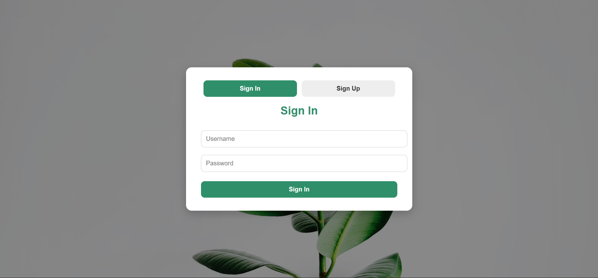
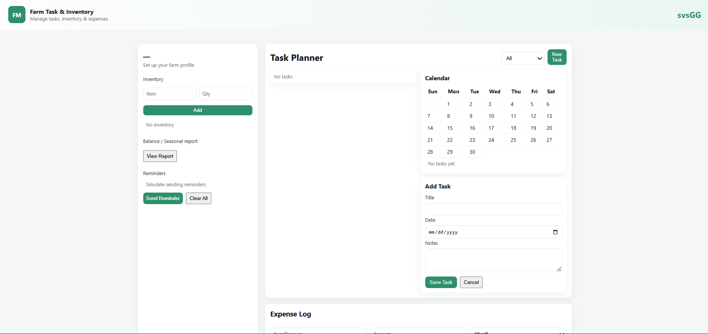
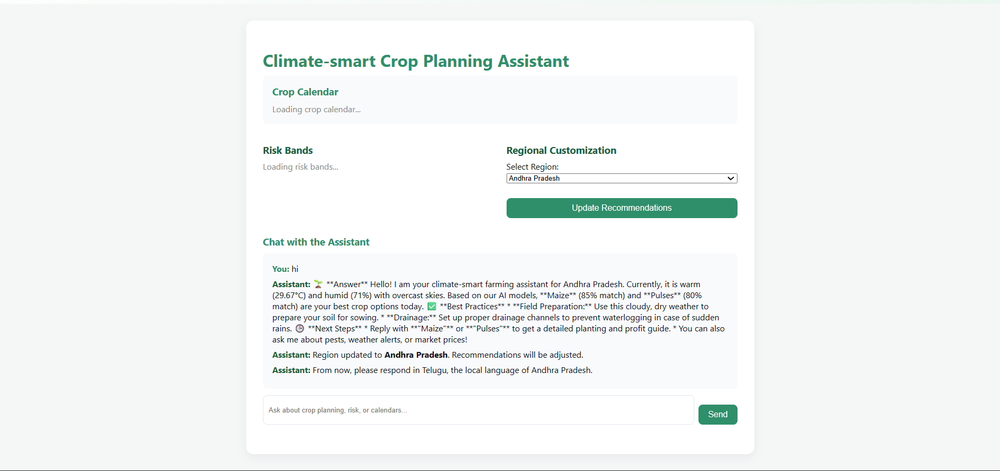
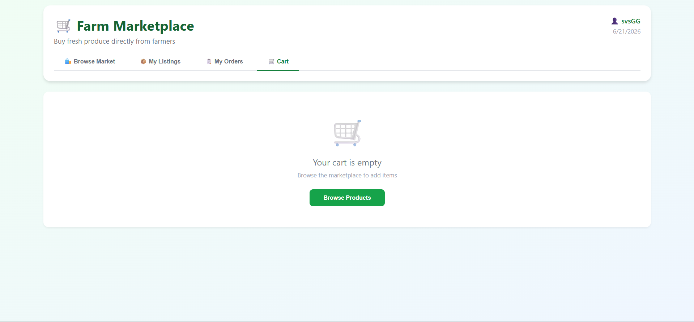

# 🌾 AI Farming Assistant

An AI-powered farming platform that helps farmers make smarter decisions using weather insights, crop recommendations, and intelligent farming assistance.

## 🚀 Live Demo

https://ai-farming-assistant-ard2.onrender.com

## 📂 GitHub Repository

https://github.com/Gani077/AI-Farming-Assistant

---

## ✨ Features

* 🌱 AI Crop Recommendations
* 🤖 Climate-Smart Farming Assistant
* 🌦️ Real-Time Weather Insights
* 🛒 Farmer Marketplace
* 📦 Inventory Management
* 💰 Expense Tracking
* 📊 Seasonal Reports & Analytics
* 📄 PDF Report Generation
* 📧 Email Notifications

---

## 🛠️ Tech Stack

### Backend

* Python
* Flask
* SQLite
* SQLAlchemy

### AI & APIs

* Google Gemini AI
* OpenWeather API

### Frontend

* HTML
* CSS
* JavaScript

### Deployment

* Render

---

## ⚙️ Installation

### Clone Repository

```bash
git clone https://github.com/Gani077/AI-Farming-Assistant.git
cd AI-Farming-Assistant
```

### Create Virtual Environment

```bash
python -m venv venv
```

### Activate Virtual Environment

```bash
venv\Scripts\activate
```

### Install Dependencies

```bash
pip install -r requirements.txt
```

### Run Application

```bash
python run.py
```

Open:

```text
http://localhost:5000
```

---

## 📁 Project Structure

```text
AI-Farming-Assistant/
│
├── app/
│   ├── __init__.py
│   ├── models.py
│   ├── routes.py
│   ├── static/
│   └── templates/
│
├── mlModels/
│   ├── crop_model.pkl
│   ├── scaler.pkl
│   └── targets.pkl
│
├── migrations/
├── requirements.txt
├── runtime.txt
├── config.py
├── run.py
├── README.md
└── .env.example
```

---
## 📸 Screenshots

### Login Page



### Dashboard



### Climate Smart Assistant



### Marketplace



---

## 🎯 Project Highlights

* AI-powered crop planning
* Weather-aware farming recommendations
* Smart farmer marketplace
* Inventory and expense management
* PDF report generation
* Live deployment on Render
* Responsive web interface

---

## 🔒 Security Notes

* Never commit `.env` files
* Store API keys in environment variables
* Use strong passwords
* Rotate exposed API keys immediately
* Keep sensitive credentials out of GitHub

---

## 🌱 Future Improvements

* Crop Disease Detection
* Advanced Machine Learning Models
* Multi-language Support
* Mobile Application
* PostgreSQL Database
* IoT Sensor Integration

---

## 👨‍💻 Developer

**Ganesh (SVS)**

📧 Email: [svsganesh077@gmail.com](mailto:svsganesh077@gmail.com)

💻 GitHub: https://github.com/Gani077

---

## 📄 License

This project is developed for educational and portfolio purposes.
